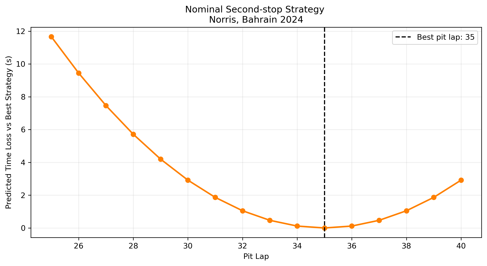
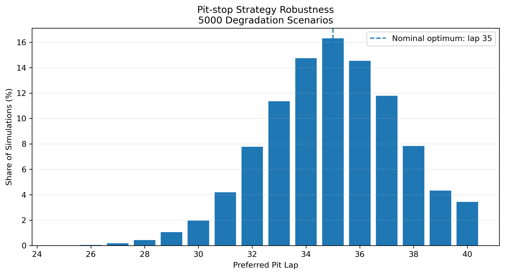

# F1 Strategy Decision Engine

A Python tool that uses simulation, sensitivity analysis and risk-aware decision making to evaluate Formula 1 race strategies - under tyre degradation, pit-loss, traffic and Safety Car uncertainty - to provide a recommended strategy with quantified risk.

This project aims to demonstrate a transparent and reproducible engineering workflow:\
**raw timing data → preprocessing → modelling → validation → optimisation → uncertainty analysis**

| **Case study**       | 2024 Bahrain Grand Prix              |\
| **Primary analysis** | McLaren Racing Hard-tyre performance |\
| **Data source**      | FastF1                               |


## 1. Engineering Problem
Pit-stop timing is an optimisation problem under uncertainty.
Tyre degradation is only partially responsible for lap time changes – the evolution of vehicle and circuit conditions throughout a race are also attributable. 
Tyre degradation therefore cannot be directly interpreted from raw lap-time trends.\
This project develops a simplified race-strategy decision model that:\
•	isolates tyre degradation effects from general race progression\
•	detects anomalous laps using robust statistics\
•	validates the degradation estimate across multiple drivers\
•	uses resulting McLaren parameters to optimise a second-stop window\
•	quantifies the affect of uncertainty in tyre degradation on the preferred pit lap 

---

## 2. Headline Results
| Metric                                         |                Result |
| ---------------------------------------------- | --------------------: |
| Norris robust Hard tyre-age effect             |      **+0.122 s/lap** |
| Norris race-progression effect                 | **−0.068 s/race lap** |
| Piastri Hard tyre-age effect                   |      **+0.111 s/lap** |
| Validated field mean                           |      **+0.108 s/lap** |
| Validated field standard deviation             |       **0.018 s/lap** |
| Driver models retained after quality screening |           **16 / 17** |
| Nominal second-stop optimum                    |            **Lap 35** |
| Most frequently preferred Monte Carlo pit lap  |            **Lap 35** |
| Central 80% preferred pit window               |        **Laps 32–38** |
| Monte Carlo scenarios                          |             **5,000** |\

Under the degradation-uncertainty model, the deterministic single optimum of lap 35 robustly broadens into a decision window of approximately laps 32–38.

---

## 3. Dataset and Preprocessing
Race timing data is accessed using the FastF1 Python package, where lap times are converted from FastF1 timedeltas into seconds.
This analysis does not require telemetry; the model operates on lap-level timing and tyre information.

For normal race-pace analysis, a lap is retained only when:\
•	IsAccurate == True \
•	TrackStatus == "1" \
•	no pit-in time is recorded \
•	no pit-out time is recorded \
•	a valid lap time is available

For cross-driver Hard-tyre modelling, only fresh Hard stints containing at least 8 clean laps are considered. Drivers require at least two usable Hard stints so that tyre age and race progression can be distinguished more reliably.

---

## 4. Tyre Degradation Model

Lap time is represented using a two-factor linear model:

$$
t_i = \beta_0 + \beta_{\mathrm{tyre}}A_i + \beta_{\mathrm{race}}L_i + \epsilon_i
$$

where:

- $t_i$ = lap time
- $A_i$ = tyre age
- $L_i$ = race lap number
- $\beta_{\mathrm{tyre}}$ = estimated lap-time increase per additional tyre lap
- $\beta_{\mathrm{race}}$ = common lap-time trend as the race progresses
- $\epsilon_i$ = unexplained residual

The race-progression coefficient is not interpreted as a direct measurement of any one physical mechanism. It absorbs effects correlated with race lap, which may include fuel-mass reduction, track evolution and other time-dependent effects.

### Why Include Race Progression?

Tyre age and race lap both increase during a stint.

For Norris' Hard-tyre data, the robust model produced:

$$
\beta_{\mathrm{tyre}} = +0.122\ \mathrm{s/lap}
$$

and:

$$
\beta_{\mathrm{race}} = -0.068\ \mathrm{s/race\ lap}
$$

The observed within-stint lap-time trend therefore contains two opposing contributions, so a simple raw lap-time gradient would consequently understate the underlying tyre-age effect.

---

## 5. Robust Residual Filtering

An initial least-squares fit is used to calculate residuals:

$$
r_i = t_{i,\mathrm{actual}} - t_{i,\mathrm{model}}
$$

Median Absolute Deviation (MAD) is then used to obtain a robust estimate of residual spread:

$$
MAD = \mathrm{median}\left(\left|r_i - \mathrm{median}(r)\right|\right)
$$

This is converted to a robust estimate comparable to standard deviation using:

$$
\sigma_{\mathrm{robust}} = 1.4826 \times MAD
$$

A lap is flagged when its residual exceeds:

$$
\left|r_i - \mathrm{median}(r)\right| > 3\sigma_{\mathrm{robust}}
$$

The model is then refitted without the flagged observations, which therefore avoids manually selecting individual laps for removal and reduces sensitivity to unusually slow or fast observations.

For Norris:
- Initial tyre-age estimate: **0.119 s/lap** 
- Robust tyre-age estimate: **0.122 s/lap** 
- Robust race-progression estimate: **−0.068 s/race lap** 
- Laps retained: **36 / 41**

---

## 6. Cross-Driver Validation

The same modelling procedure is applied to all drivers meeting the fresh-Hard stint criteria.

Each refitted model is assessed using root-mean-square error (RMSE):

$$
RMSE = \sqrt{\frac{1}{n}\sum_{i=1}^{n}r_i^2}
$$

Model-quality screening is itself performed robustly.

The field RMSE distribution is characterised using its median and MAD, with models above:

$$ RMSE_{\mathrm{threshold}} = RMSE_{\mathrm{median}} + 3\sigma_{\mathrm{robust}} $$

classified as poor fits.

One of the 17 eligible driver models exceeded this threshold, leaving **16 validated models**.

### Validated Field Result

Mean tyre-age effect: **0.108 s/lap** \
Standard deviation: **0.018 s/lap**

McLaren estimates:
- Oscar Piastri: **0.111 s/lap** 
- Lando Norris: **0.122 s/lap**

$$ \therefore mean \approx **0.117 s/lap** $$
for the modelled Hard-tyre age effect in this race.

The cross-driver comparison is used as a plausibility and model-quality check rather than as evidence that every driver or car experiences identical degradation.
________________________________________
## 7. Deterministic Pit-Stop Optimisation

A simplified second-stop decision is evaluated from **lap 20**, when Norris is on a Hard tyre with a tyre age of 7 laps. Stop laps are evaluated from **lap 25 to lap 40**. For each candidate pit lap, the model predicts all remaining laps to the end of the 57-lap race. Tyre age increases on the existing set until the selected stop, then resets on the fresh Hard set.

The total modelled remaining time is:

$$
T(p) = \sum_{i=21}^{57} t_i(p) + T_{\mathrm{pit}}
$$

where a nominal constant pit-loss assumption of:

$$
T_{\mathrm{pit}} = 22.0\ \mathrm{s}
$$

is used.

### Result

The minimum predicted remaining race time occurs for:

$$
\boxed{p = 35}
$$



The optimisation curve is approximately U-shaped, showing that:\
- stopping earlier increases the length of the final stint\
- stopping later increases the time spent on the ageing first set\
- the minimum represents the balance between these effects

### Interpretation of Pit Loss

Every candidate strategy within the optimisation window contains exactly one pit stop, of **22s**. This constant **22 s pit loss** therefore shifts all one-stop strategies by the same amount and does **not** determine which candidate pit lap is fastest. This becomes relevant when comparing strategies containing different numbers of stops.

---

## 8. Strategy Robustness Under Degradation Uncertainty

A deterministic optimum does not quantify confidence in the decision. To investigate robustness, a Monte Carlo analysis is performed using **5,000 scenarios**.

The validated cross-driver standard deviation:

$$
\sigma_d = 0.018\ \mathrm{s/lap}
$$

is used as a **proxy for degradation uncertainty**.

For each simulation, separate degradation rates are sampled for the current and subsequent Hard stint around the nominal McLaren degradation estimate. Each scenario follows the observed lap-20 race state before the candidate pit laps are re-evaluated. The simulation records which pit lap produces the minimum modelled remaining race time.

### Monte Carlo Result

Most frequently preferred pit lap:

$$
\boxed{35}
$$

Central 80% of preferred pit-lap outcomes:

$$
\boxed{32 \leq p \leq 38}
$$



This gives two different engineering outputs:\
- **Nominal decision:** lap 35\
- **Robust decision region:** approximately laps 32–38

This distinction reveals how sensitive the optimum is to uncertain inputs.

---

## 9. Assumptions and Model Boundaries

| Assumption | Engineering Implication |
|---|---|
| Linear tyre degradation | Does not capture nonlinear wear, thermal degradation or a tyre-performance cliff |
| Constant degradation within each simulated stint | Real degradation can evolve with operating conditions and tyre state |
| Constant 22 s pit loss | Does not represent traffic-dependent or neutralised-race pit losses |
| Same Hard compound before and after the stop | Simplifies compound-selection effects |
| No traffic interaction | Undercut, overcut and overtaking effects are excluded |
| No Safety Car or VSC | Neutralisation effects are not represented |
| No tyre warm-up model | Fresh-tyre out-lap performance is simplified |
| Race-lap term is empirical | It does not independently identify fuel, track evolution or other mechanisms |
| Cross-driver spread used for uncertainty | It is a proxy, not a formal McLaren-specific parameter uncertainty |
| Linear extrapolation at high tyre ages | Predictions outside the observed tyre-age range should be treated cautiously |

The hypothetical no-stop strategy extends the tyre model substantially beyond the tyre ages strongly supported by the observed data. It is therefore retained only as a reference baseline and is not treated as a realistic prediction.

---

## 10. Engineering Interpretation

Three findings are particularly important.

### Separating Correlated Effects Matters
Raw lap-time evolution is not equivalent to tyre degradation.\
The model demonstrates that tyre ageing and general race progression act simultaneously and in opposite directions.

### Model Quality Must Be Checked Before Optimisation
The degradation model is not used directly after fitting.\
Residual screening, cross-driver comparison and RMSE-based model-quality filtering are performed first.

### An Optimum Without Sensitivity Information Is Incomplete
The deterministic model identifies lap 35, but the uncertainty analysis shows that nearby decisions remain competitive.\
For this model, the more useful strategic conclusion is:

> **Lap 35 is the nominal optimum, while laps 32–38 form the central robust decision window under the chosen degradation-uncertainty model.**

---

## 11. Repository Structure

The repository contains:

- `analysis.py` — main analysis and strategy-modelling script
- `README.md` — project documentation
- `requirements.txt` — Python dependencies
- `.gitignore` — excludes local cache and temporary files
- `figures/` — generated engineering plots
- `results/` — numerical model and strategy outputs

```text
raceops-f1-strategy/
├── analysis.py
├── README.md
├── requirements.txt
├── .gitignore
├── figures/
│   ├── hard_tyre_validation.png
│   ├── nominal_pit_strategy.png
│   └── strategy_robustness.png
└── results/
    ├── hard_tyre_model_results.csv
    ├── nominal_strategy_results.csv
    └── strategy_robustness_results.csv
This is an independent engineering portfolio project based on publicly accessible motorsport timing data. It is not affiliated with McLaren Racing, Formula 1 or their commercial partners.
